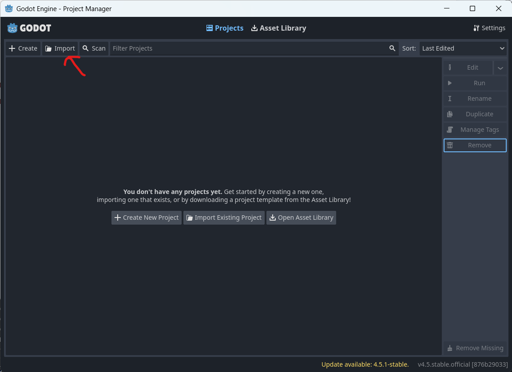
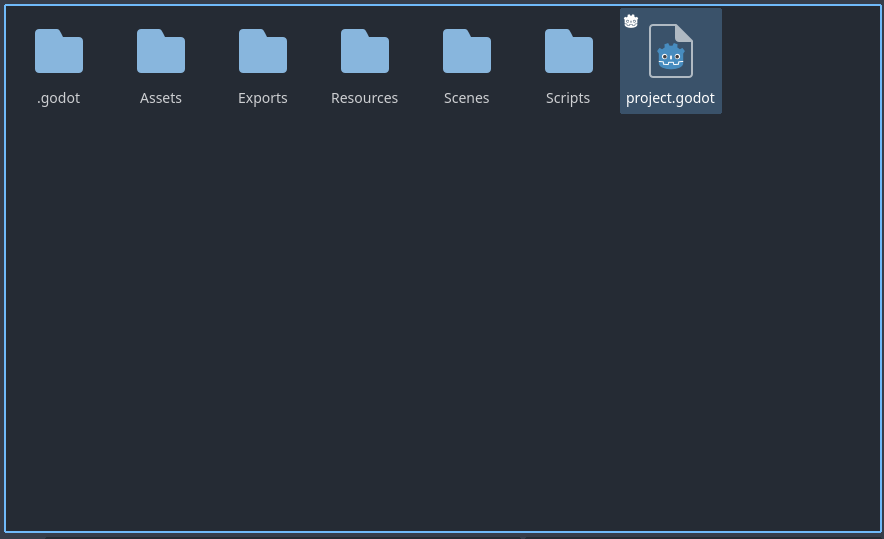
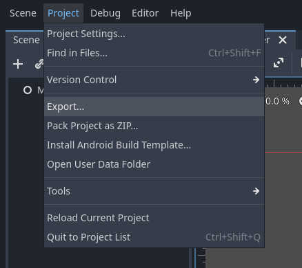
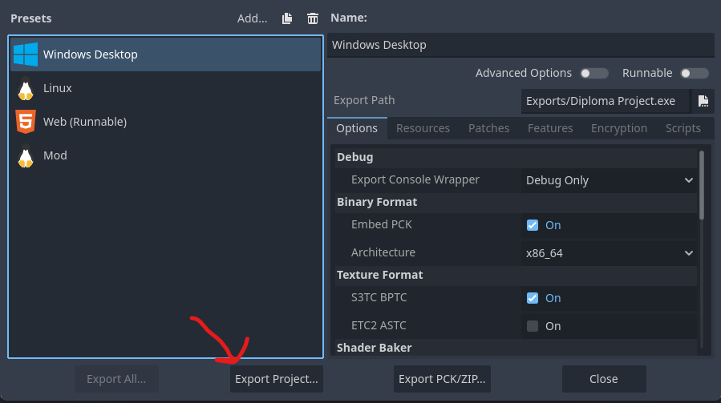

# Stranded Shores
## Game Description
**Survive the Island**  
Gather resources, craft tools, build your base, and hold your ground when the dangers of the night come knocking. During the day, explore the island, chop trees, mine rocks, and stockpile everything you need to survive.  

**Danger After Dark**  
When darkness falls, things get a lot less peaceful. Plan your defenses, gear up, and make sure you're ready before the sun goes down.

**Play Your Way**  
Progress at your own pace, experiment with different strategies, and see how long you can last.  

## Download
Play the latest build on: https://kris-nikolov.itch.io/stranded-shores or download it from the Github Releases tab.

## Build Instructions
1. Clone the repo
2. Download [Godot](https://godotengine.org/download) 4.6 or later.
3. Open Godot, click on Import and select the `project.godot` file inside the repository folder.
   
   
   
4. Once loaded click on `Project -> Export`
   
     
5. Select your platform and click on `Export Project`
   
   

## Modding
Modding instructions can be found here: https://github.com/KristianNikolov07/stranded-shores/wiki

## Credits and Attributions
Developed by: Kristian Nikolov  
Playtesters: Alexander Stoyanov and Nathaniel Nechevski  
Original assets: Kristian Nikolov and Alex Nikolova  

Font: https://yukipixels.itch.io/boldpixels  
Chests: https://pixelserial.itch.io/rpg-pixel-art-chests  

### Sounds
Sword Slash 01: https://pixabay.com/sound-effects/film-special-effects-sword-slash-01-266296/  
Hit Tree 01: https://pixabay.com/sound-effects/film-special-effects-hit-tree-01-266310/  
Hit Rock 02: https://pixabay.com/sound-effects/film-special-effects-hit-rock-02-266304/  

## License
All original content in this project is licensed under the [GNU GPL-3.0 license](LICENSE)
